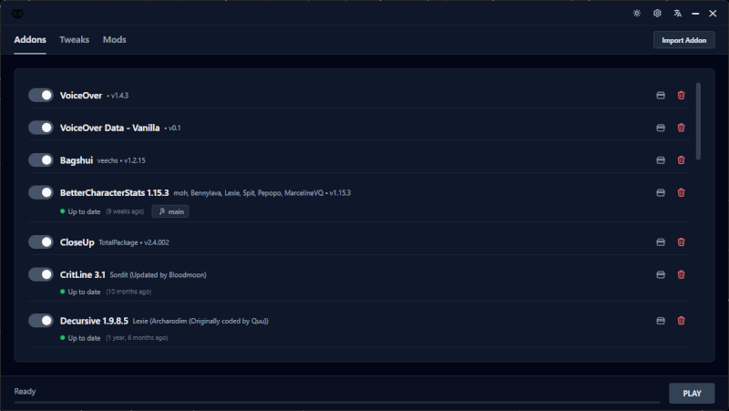

# OWL

**O**pen-source **W**ow **L**auncher for World of Warcraft Classic 1.12.1 and WoTLK 3.3.5a.

<p align="center">
  
</p>

## Features

- Launch World of Warcraft from a local installation.
- Enable, disable and update installed addons.
- Enable and disable patch files.
- Edit `config.wtf` game settings through the launcher.

## Install

Download the latest release from [here](https://github.com/Taeko-ar/Owl/releases).

<!-- CHECKSUM_TABLE_START -->

| File Name | MD5 Checksum | SHA-256 Checksum |
| --- | --- | --- |
| `OWL-1.0.0-1.x86_64.rpm` | `b4c6d83f139bc4abea8b3870f8c1bd31` | `f7b89c3b37f09ea034de96f1d880a917b4b03dfc37920a65e43f8607750364d9` |
| `OWL_1.0.0_amd64.AppImage` | `35dcfc7c54db0dafdc45fc9deeadd34d` | `f2f9c44c7e788843a1da2460a988230b71f0a2eb63a2475f63439157eac9dc43` |
| `OWL_1.0.0_amd64.deb` | `0e2f41e5973889ad297c8e1d71df3e49` | `9a1cf4af66e04a89bfc6a3e1170bb5c77b376fa4a3c990f681b2da367c129f0f` |
| `OWL_1.0.0_universal.dmg` | `3f03e4d1509cf323833109120affa6e8` | `ff1623283c75a5b5ecdef9c96b934ece117e8803af442b5eeb13cfe66e3b854d` |
| `OWL_1.0.0_x64-setup.exe` | `042db26ed1f033ebb82b8f5b207740b5` | `e2af69a8d9b55ccf7112d7db7990501461429ab97501e33b7ceb0a4280d527d2` |
| `OWL_1.0.0_x64_en-US.msi` | `8f3d1ae5e450146982104e67b3382bc3` | `a4c936f627e03da5e5243d6039989290aad9c7e50809f7fa6878bf367381d273` |
| `OWL_universal.app.tar.gz` | `0bd3b670b7ce001ab29e4798192ba4c2` | `72322604f50d1ec1a61b6b843cfa6cc8a4f96bf226023750348a418b8f6c81d5` |

<!-- CHECKSUM_TABLE_END -->

## Local development

1. Install dependencies:

   ```bash
   npm install
   ```

- Run in development mode:

   ```bash
   # Backend
   npm run dev
   ```

   ```bash
   # Frontend
   npm run preview
   ```

- Build for production:

   ```bash
   npm run build
   ```
